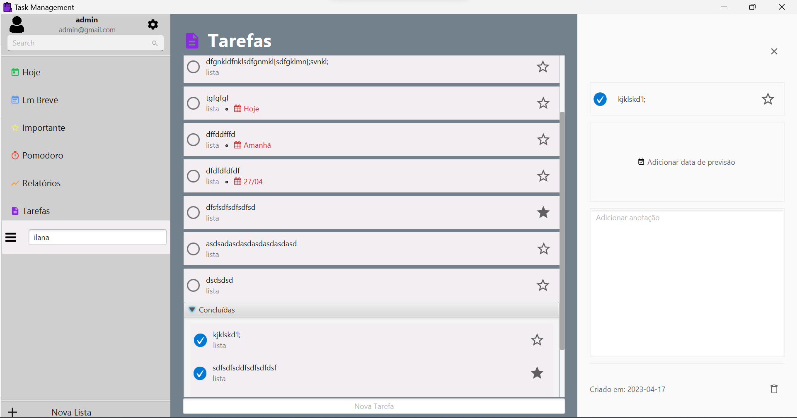

<h1 style="text-align: center;">Task Management</h1>   

    

### Tópicos

:o: [Descrição do projeto](#descrição-geral-do-projeto-pencil)

:o: [Exemplo de Telas](#exemplo-de-telas)

:o: [Funcionalidades](#funcionalidades)

:o: [Pré-requisitos](#pré-requisitos)

:o: [Como rodar a aplicação](#como-rodar-a-aplicação-arrow_forward)

:o: [Desenvolvedores](#desenvolvedores-octocat)

## Exemplo de telas





## Funcionalidades

:pushpin: O sistema deve permitir que o usuário crie, visualize, edite e exclua tarefas.

:pushpin: O sistema deve permitir que o usuário atribua uma prioridade e uma cor para cada tarefa.

:pushpin: As tarefas devem ser organizadas em categorias (por exemplo, trabalho, pessoal, estudos).

:pushpin: O sistema deve permitir que o usuário marque uma tarefa como concluída ou não concluída.

:pushpin: O sistema deve permitir o login de usuários.

:pushpin: O sistema deve possuir um temporizador Pomodoro, para que o usuário possa cronometrar o tempo dedicado a uma determinada tarefa.

:pushpin: O sistema deve permitir que o usuário visualize todas notas criadas. Podendo filtra-las por categoria.

## Pré-requisitos

:heavy_exclamation_mark: [JDK17](https://www.oracle.com/br/java/technologies/downloads/#java17)  
:heavy_exclamation_mark: [FontAwesome Icons](https://repo1.maven.org/maven2/de/jensd/fontawesomefx-fontawesome/4.7.0-9.1.2/)
:heavy_exclamation_mark: [FontAwesome Material Icons](https://repo.maven.apache.org/maven2/de/jensd/fontawesomefx-materialicons/2.2.0-9.1.2/)
:heavy_exclamation_mark: [Jfoenix](https://jar-download.com/artifacts/com.jfoenix/jfoenix/9.0.10/source-code)

## Como rodar a aplicação :arrow_forward:

No terminal, clone o projeto:

```  
git@github.com:ArgelBM/Task-Management.git
```  
**Certique-se as bibliotecas de icones estão ativas, configure seu Javafx no projeto e execute o Main.java**

## Desenvolvedores :octocat:

| [<br><sub>Argel Bezerra</sub>](https://github.com/Ventoooo)  | [<br><sub>Ilana Brochardt</sub>](https://github.com/Ilanabrochardt) | [<br><sub>João Lucas</sub>](https://github.com/lukajlp) |  
| ------------- | ------------- | ------------- | 
| [](mailto:arbezerra14@outlook.com)  | [](mailto:ilanabrochardtps@gmail.com)  |  [](mailto:joaolucas.psantana@gmail.com)
